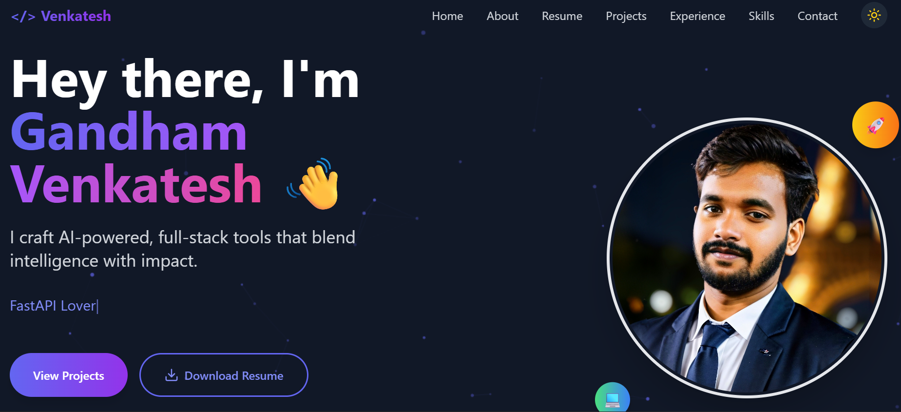
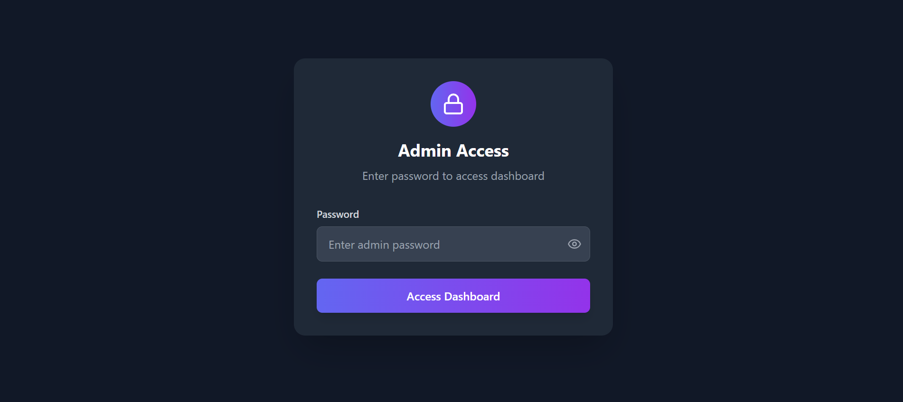
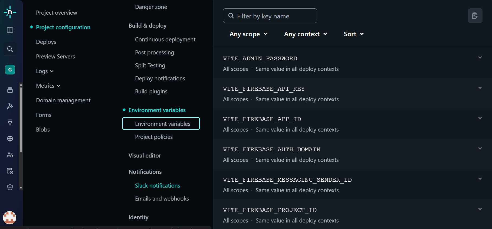

# Dynamic Developer Portfolio Template

A modern, data-driven, and easily customizable developer portfolio website. Built with **React**, **TypeScript**, and **Bolt**, this template lets you showcase your skills, projects, and experience with a beautiful UI and a secure admin dashboard to manage your content on the fly.



### ✨ Live Demo

**[Venkatesh Gandham Portfolio](https://venkatesh-gandham.netlify.app/)**

---

## 🚀 Features

* **Single File Customization**: All your data is managed from `src/data/portfolioData.ts`.
* **Admin Dashboard**: A secure, password-protected dashboard at `/admin-dashboard` to edit your portfolio content live.
* **Modern UI/UX**: Clean design with smooth animations.
* **Project Filtering**: Filter projects based on technology tags.
* **Fully Responsive**: Looks great on all devices.
* **Dark Mode**: For comfortable viewing.

---

## 🔒 Admin Dashboard & Security Setup

This template includes a built-in admin dashboard to manage your portfolio content in real-time without touching the code.




To secure the dashboard, you **must** set a password as an **Environment Variable** on your deployment platform (e.g., Netlify, Vercel).

#### How to set up your Admin Password on Netlify:

1.  **Go to your Netlify Site:**
    * Log in to Netlify and go to your site's dashboard.

2.  **Navigate to Environment Variables:**
    * Go to **Project configuration** > **Build & deploy** > **Environment**.

3.  **Add the Password Variable:**
    * Click on **"Add a variable"**.
    * For the **Key**, enter exactly: `VITE_ADMIN_PASSWORD`
    * For the **Value**, enter the secret password you want to use.
    * Click **"Create variable"**.

    

4.  **Redeploy:**
    * Go to the "Deploys" tab and trigger a new deploy to apply the environment variable.

Now, you can access your dashboard at `https://your-site-url.com/admin-dashboard` and log in with the password you just set.

---

## 🛠️ Getting Started

Follow these simple steps to get your portfolio up and running.

1.  **Clone the repository:**
    ```bash
    git clone https://github.com/Gandham-Venkatesh/react-dynamic-portfolio.git
    ```
2.  **Navigate to the project directory:**
    ```bash
    cd react-dynamic-portfolio
    ```
3.  **Install the dependencies:**
    ```bash
    npm install
    npm install lodash
    npm install --save-dev @types/lodash
    ```
4.  **Run the development server:**
    ```bash
    npm run dev
    ```
    Your portfolio will now be live at `http://localhost:5173`.

---

## ⚙️ How to Customize Your Portfolio

This is the fun part! All the content on the website is powered by the `src/data/portfolioData.ts` file. Just open this file and replace the placeholder data with your own.

### 1. `personalInfo`

This object holds all your personal and hero section details.

```typescript
personalInfo: {
  // Details for various sections
  name: "Your Name",
  title: "Your awesome title",
  email: "your.email@example.com",
  linkedin: "[https://linkedin.com/in/your-profile](https://linkedin.com/in/your-profile)",
  github: "[https://github.com/your-username](https://github.com/your-username)",
  
  // New fields for the Hero section
  tagline: "Your catchy tagline here.",
  loopingTexts: ["Full Stack Developer", "AI Enthusiast", "Tech Explorer"],
  
  // Profile Picture Setup
  // 1. Place your image (e.g., profile.jpg) inside the `/public` folder.
  // 2. Set the path here. It should start with a '/'.
  profileImage: "/profile.jpg",

  // Other details
  about: "A detailed paragraph about you...",
  resumeLink: "Link to your resume PDF",
  // ...and so on.
},
```

### 2. `skills`

An array of objects for skill categories. The `level` property (0-100) controls the progress bar.

```typescript
skills: [
  {
    category: "Frontend",
    skills: [
      { name: "React", level: 92 },
      { name: "HTML/CSS", level: 95 },
    ]
  },
  // ... more categories
],
```

### 3. `projects`

An array for all your projects. `tags` are used for filtering.

```typescript
projects: [
  {
    id: "1",
    name: "My Awesome Project",
    description: "A short and crisp description of your project.",
    link: "[https://github.com/your-username/your-project](https://github.com/your-username/your-project)",
    tags: ["React", "AI", "Full Stack"],
    visible: true
  }
],
```

### 4. `internship`

Details of your latest internship or work experience.

```typescript
internship: {
  company: "Awesome Company Inc.",
  role: "Software Developer Intern",
  duration: "May 2025 – June 2025",
  description: [
    "Built an amazing feature using Python.",
    "Created REST APIs for the main application."
  ]
}
```

---

## 🚀 Deployment

Once you've customized your portfolio, push the code to GitHub. You can easily deploy it for free on platforms like **Netlify** or **Vercel**.

---

## 👨‍💻 Author

Created & Maintained By:

💻 **Venkatesh Gandham** ([LinkedIn](https://www.linkedin.com/in/venkateshgandham))

If you like this portfolio, ⭐ star the repo and share it with your dev friends!
