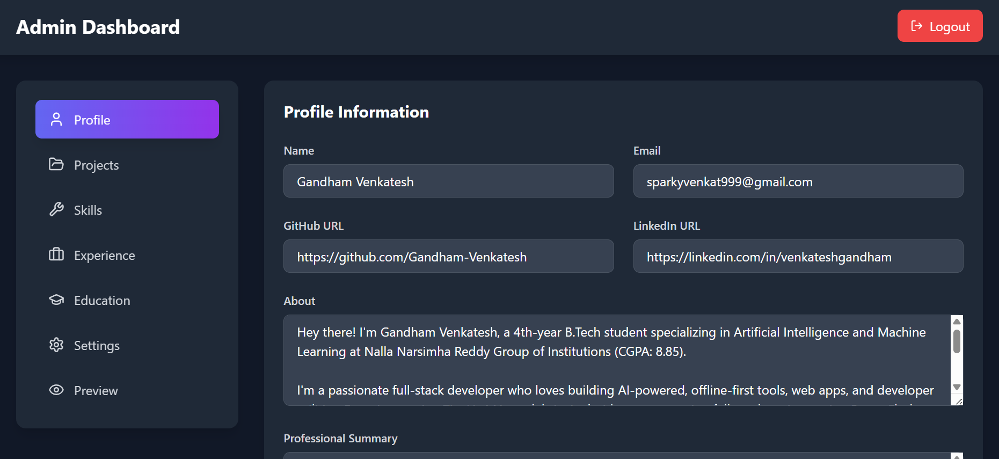

# 🚀 Dynamic Portfolio with Firebase & Admin Dashboard

A modern, fully data-driven developer portfolio built with **React**, **TypeScript**, and **Firebase**. This template allows you to showcase your skills, projects, and experience through a beautiful UI, with all content managed dynamically from a secure admin dashboard.

 

### ✨ Live Demo

**[Venkatesh Gandham Portfolio](https://venkatesh-gandham.netlify.app/)**

---

## 🚀 Core Features

* **Firebase Backend**: Your portfolio data is fetched live from Firestore, making it truly dynamic.
* **Powerful Admin Dashboard**: A secure, password-protected dashboard at `/admin-dashboard` to edit your entire portfolio in real-time. No more editing code for content changes!
* **Local Data Fallback**: If Firebase fails to load for any reason, the portfolio gracefully falls back to local data from `portfolioData.ts`, ensuring your site is **always online and functional**.
* **One-Time Seeding**: A simple `seed.js` script to upload your initial data to Firebase in a single command.
* **Modern UI/UX**: Clean design with smooth animations, project filtering, and a dark mode.
* **Fully Responsive**: Looks great on all devices, from mobile phones to desktops.

---

## 🔒 Admin Dashboard

Manage your entire portfolio—personal info, skills, projects, experience, and education—from a user-friendly interface.

**1. Secure Login:**
 <!-- TODO: Replace with your admin login page screenshot -->

**2. Full Content Management:**
 <!-- This is the screenshot you provided -->

---

## 🛠️ Complete Setup Guide

Follow these steps carefully to get your own portfolio live.

### Step 1: Clone and Install

First, clone the repository and install the necessary dependencies.

```bash
git clone [https://github.com/Gandham-Venkatesh/react-dynamic-portfolio.git](https://github.com/Gandham-Venkatesh/react-dynamic-portfolio.git)
cd react-dynamic-portfolio
npm install
npm install lodash
npm install --save-dev @types/lodash
```

### Step 2: Firebase Project Setup

This portfolio uses Firebase to store and manage your data.

1.  **Create a Firebase Project**: Go to the [Firebase Console](https://console.firebase.google.com/) and create a new project.
2.  **Create a Firestore Database**:
    * In your project, go to the **Firestore Database** section.
    * Click **"Create database"**. Start in **production mode**.
    * Choose a location closest to you (e.g., `asia-south1`).
3.  **Set Firestore Security Rules**:
    * Go to the **Rules** tab in Firestore.
    * Replace the default rules with the following to allow anyone to read the data:
        ```
        rules_version = '2';
        service cloud.firestore {
          match /databases/{database}/documents {
            // Allow public read access to your portfolio data
            match /portfolio/mainData {
              allow read: if true;
              allow write: if request.auth != null; // Secure for future use
            }
          }
        }
        ```
    * Click **Publish**.
4.  **Get Your Firebase Credentials**:
    * In your project settings (click the ⚙️ gear icon), go to the **General** tab.
    * Scroll down to "Your apps" and click the web icon (`</>`) to create a new web app.
    * Register the app, and Firebase will give you a `firebaseConfig` object. Keep this handy.

### Step 3: Set Up Environment Variables

To keep your Firebase credentials and admin password secure, we use environment variables.

1.  **Create a `.env` file** in the root of your project.
2.  **Add your Firebase credentials and a secure admin password** to the `.env` file. Use the `VITE_` prefix for each key.

    ```env
    # Paste your credentials from Firebase here
    VITE_FIREBASE_API_KEY="YOUR_API_KEY"
    VITE_FIREBASE_AUTH_DOMAIN="YOUR_AUTH_DOMAIN"
    VITE_FIREBASE_PROJECT_ID="YOUR_PROJECT_ID"
    VITE_FIREBASE_STORAGE_BUCKET="YOUR_STORAGE_BUCKET"
    VITE_FIREBASE_MESSAGING_SENDER_ID="YOUR_SENDER_ID"
    VITE_FIREBASE_APP_ID="YOUR_APP_ID"

    # Set a secure password for your admin dashboard
    VITE_ADMIN_PASSWORD="YOUR_SECRET_PASSWORD"
    ```

   
3.  **Important**: Your `.gitignore` file should already contain a line for `.env` to prevent it from being uploaded to GitHub.

### Step 4: Customize Your Data in `portfolioData.ts`

This is the most important step for personalizing your content. The file `src/data/portfolioData.ts` is the **single source of truth** for your initial setup and also acts as a **fallback** if the Firebase connection fails.

Open this file and replace all the placeholder content with your own details.

#### `personalInfo`
This object holds all your personal and hero section details.

```typescript
personalInfo: {
  name: "Your Name",
  title: "Your awesome title",
  email: "your.email@example.com",
  linkedin: "[https://linkedin.com/in/your-profile](https://linkedin.com/in/your-profile)",
  github: "[https://github.com/your-username](https://github.com/your-username)",
  tagline: "Your catchy tagline here.",
  loopingTexts: ["Full Stack Developer", "AI Enthusiast", "Tech Explorer"],
  
  // Profile Picture: Place your image (e.g., profile.jpg) inside the `/public` folder.
  // Then, set the path here starting with a '/'.
  profileImage: "/profile.jpg",

  about: "A detailed paragraph about you...",
  resumeLink: "Link to your resume PDF",
  // ...and so on for all fields.
},
```

#### `skills`
An array of objects for skill categories. The `level` property (0-100) controls the progress bar.

```typescript
skills: [
  {
    category: "Frontend",
    skills: [
      { name: "React", level: 92 },
      { name: "HTML/CSS", level: 95 },
    ]
  },
  // ... more categories
],
```

#### `projects`
An array for all your projects. `tags` are used for filtering.

```typescript
projects: [
  {
    id: "1",
    name: "My Awesome Project",
    description: "A short and crisp description of your project.",
    link: "[https://github.com/your-username/your-project](https://github.com/your-username/your-project)",
    tags: ["React", "AI", "Full Stack"],
    visible: true
  }
],
```

#### `experiences` & `education`
Arrays of objects for your work experience and educational background.

```typescript
experiences: [
    {
      id: "exp1",
      company: "Awesome Company Inc.",
      role: "Software Developer Intern", 
      duration: "May 2025 – June 2025",
      description: [
        "Built an amazing feature using Python.",
        "Created REST APIs for the main application."
      ]
    }
],
```

### Step 5: Seed Your Database with `seed.js`

Now, let's upload the data you just customized to Firebase.

1.  **Copy Data to `seed.js`**:
    * Open the `seed.js` file in the root directory.
    * You will see a variable `portfolioDataToUpload`.
    * Go back to `src/data/portfolioData.ts`, copy the entire `initialPortfolioData` object, and **paste it over** the placeholder object in `seed.js`. This ensures you upload the latest version of your data.
2.  **Run the Seed Script**:
    * Execute the script from your terminal to upload the data to Firestore.
    ```bash
    node seed.js
    ```
    * You should see a success message. You can now verify the data in your Firebase console under `portfolio/mainData`.

### Step 6: Deploy on Netlify

You are all set for deployment!

1.  Push your code to a GitHub repository.
2.  Log in to Netlify and create a new site from your GitHub repo.
3.  **Crucial Step**: In your Netlify site settings, go to **Site configuration > Build & deploy > Environment** and click **"Add a variable"**. Add the **same environment variables** you defined in your `.env` file (`VITE_FIREBASE_...` and `VITE_ADMIN_PASSWORD`).
4.  Click **"Deploy site"**. Your portfolio is now live!

---

## 👨‍💻 Author

Created & Maintained By:

💻 **Venkatesh Gandham** ([LinkedIn](https://www.linkedin.com/in/venkateshgandham))

If you find this template useful, please ⭐ star the repo and share it with your friends!
