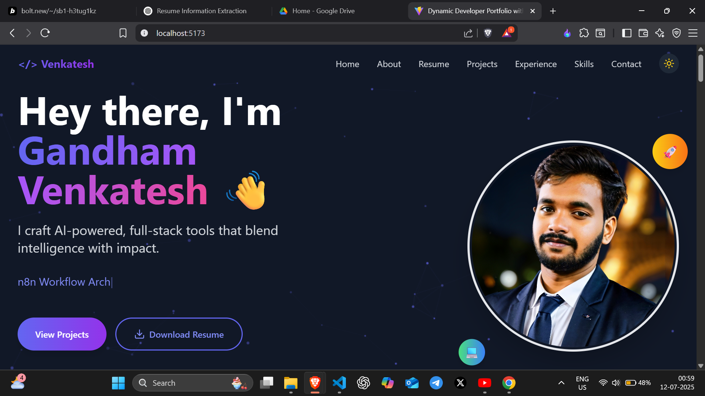

# Dynamic Developer Portfolio Template

Hey there! This is a dynamic, modern, and easily customizable developer portfolio website. Built with **React**, **TypeScript**, and **Bolt**, this template lets you showcase your skills, projects, and experience with a beautiful UI and smooth animations.

The best part? You don't need to touch any component code. Just update a single file with your information, and the entire website will magically update itself!




### ✨ Live Demo

**[Venkatesh Gandham Portfolio](https://venkatesh-gandham.netlify.app/)**

---

## 🚀 Features

* **Single File Customization**: All your personal info, skills, projects, and experience are managed from one central `portfolioData.ts` file.
* **Modern UI/UX**: Clean design with subtle animations to keep things engaging.
* **Skills Showcase**: Display your skills with progress bars, neatly organized by category.
* **Project Filtering**: Visitors can filter your projects based on technology tags (e.g., React, AI, Node.js).
* **Fully Responsive**: Looks great on all devices, from mobile phones to desktops.
* **Dark Mode**: Comfortable viewing in any lighting condition.

---

## 🛠️ Getting Started

Follow these simple steps to get your portfolio up and running.

### Prerequisites

Make sure you have Node.js and npm (or yarn) installed on your machine.

### Installation

1.  **Clone the repository:**
    ```bash
    git clone https://github.com/Gandham-Venkatesh/react-dynamic-portfolio.git
    ```
2.  **Navigate to the project directory:**
    ```bash
    cd your-repo-name
    ```
3.  **Install the dependencies:**
    ```bash
    npm install
    ```
4.  **Run the development server:**
    ```bash
    npm run dev
    ```
    Your portfolio will now be live at `http://localhost:5173`.

---

## ⚙️ How to Customize Your Portfolio

This is the fun part! All the content on the website is powered by the `src/data/portfolioData.ts` file. Just open this file and replace the placeholder data with your own.

The main structure looks like this:

```typescript
import { PortfolioData } from '../types';

export const initialPortfolioData: PortfolioData = {
  personalInfo: { ... },
  skills: [ ... ],
  projects: [ ... ],
  internship: { ... }
};
```

Here's a breakdown of each section:

### 1. `personalInfo`

This object holds all your personal details.

```typescript
personalInfo: {
  name: "Your Name",
  title: "Your awesome title",
  email: "your.email@example.com",
  linkedin: "[https://linkedin.com/in/your-profile](https://linkedin.com/in/your-profile)",
  github: "[https://github.com/your-username](https://github.com/your-username)",
  college: "Your College Name",
  cgpa: "Your CGPA",
  about: "A detailed paragraph about you...",
  currentlyExploring: ["Tech A", "Tool B"],
  resumeLink: "Link to your resume PDF",
  professionalSummary: "A summary for your resume section..."
},
```

### 2. `skills`

This is an array of objects, where each object represents a skill category (like "Frontend", "Backend", etc.). The `level` property (0-100) controls the length of the progress bar.

```typescript
skills: [
  {
    category: "Frontend",
    skills: [
      { name: "React", level: 92 },
      { name: "HTML/CSS", level: 95 },
    ]
  },
  {
    category: "Backend",
    skills: [
      { name: "Node.js", level: 87 },
      { name: "FastAPI", level: 80 },
    ]
  }
],
```

### 3. `projects`

This is an array for all your projects. The `tags` are used for the filter buttons on the projects page. Set `visible: true` to make a project appear.

```typescript
projects: [
  {
    id: "1",
    name: "My Awesome Project",
    description: "A short and crisp description of your project.",
    link: "[https://github.com/your-username/your-project](https://github.com/your-username/your-project)",
    tags: ["React", "AI", "Full Stack"],
    visible: true
  }
],
```

### 4. `internship`

This object holds the details of your latest internship or work experience. The `description` is an array of strings, where each string is a bullet point.

```typescript
internship: {
  company: "Awesome Company Inc.",
  role: "Software Developer Intern",
  duration: "May 2025 – June 2025",
  description: [
    "Built an amazing feature using Python.",
    "Created REST APIs for the main application.",
    "Collaborated with the team to deliver results."
  ]
}
```

---

## 🚀 Deployment

Once you've customized your portfolio and pushed the code to your GitHub repository, you can easily deploy it for free on platforms like:

* **Netlify**
* **Vercel**

Both platforms usually auto-detect that it's a React/Vite project and configure the build settings for you.

---

## 👨‍💻 Author

Created & Maintained By:

💻 **Venkatesh Gandham** ([LinkedIn](https://www.linkedin.com/in/venkateshgandham))

If you like this portfolio, ⭐ star the repo and share it with your dev friends!
